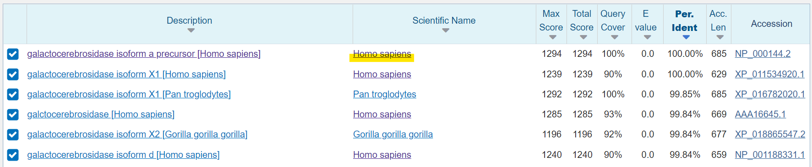
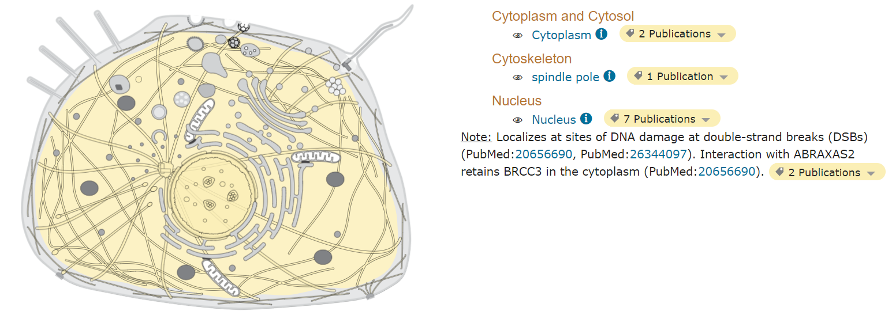
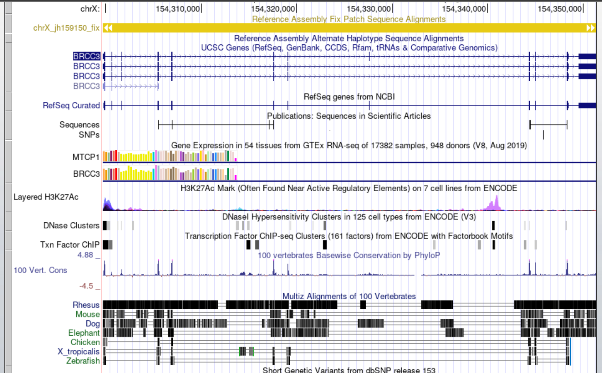
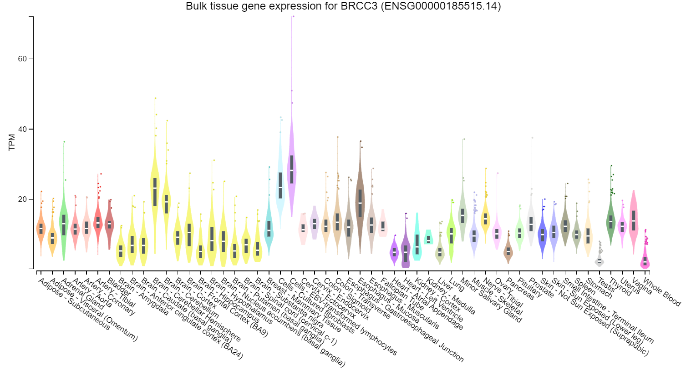

```{r,echo=FALSE,message=FALSE,warning=FALSE}
# Set so that long lines in R will be wrapped:
knitr::opts_chunk$set(tidy.opts=list(width.cutoff=80), tidy=TRUE)
```


# Exercise 1. Identify to which human gene your sequence belongs to

## 1.1. Which gene does your polypeptide sequence belong to?

**(A) :** My FASTA Sequence belongs to **Homo sapiens**.




## 1.2. Where is this protein located sub-cellularly?
**(A) :** This protein's name is **Lys-63-specific deubiquitinase BRCC36** which encoded by gene **BRCC3**, it's located at **Cytoplasm**, **Cytoskeleton**, or **Nucleus**.




## 1.3. What might be the biological purpose of your gene/protein? Is it related to any diseases or biological conditions?

**(A) :** This protein is the subunit of the BRCA1-BRCA2-containing complex (BRCC), which is an E3 ubiquitin ligase. This protein is also thought to be involved in the cellular response to ionizing radiation and progression through the G2/M checkpoint. It plays a role in the **DNA damage response**, where it is responsible for the stable accumulation of BRCA1 at DNA break sites [1].

# Exercise 2. Find the gene itself

## 2.1. On which chromosome and where on it is your gene located?

**(A :** The gene **BRCC3** is located at from **154,310,000 to 154,350,000**.




## 2.2. Play around a bit – zoom in, change settings, click on elements…

## 2.3. Does your gene contain any conserved DNA sequences when compared to other species? If yes, can you notice a pattern in terms of the conserved loci? Why do you think that is?

**(A) :** yes, compareing to others species(e.g., mouse, dog or elephant), shown as 2.1., humen has higher conserved DNA sequences. The reson why we have higher conserved DNA sequence because our body thought this gene has functional value, therefore our body descide to keep it more.

# Exercise 3. In which tissue is your gene most highly expressed?

**(A) :** In tissue **Cells - EBV-transformed lymphocytes** contains highest gene **BRCC3**.




# Reference

[1] BRCC3 BRCA1/BRCA2-containing complex subunit 3 [ Homo sapiens (human) ]. (2022). NCBI. https://www.ncbi.nlm.nih.gov/gene/79184#:%7E:text=BRCC3%20likely%20plays%20a%20role,mechanism%20underlying%20BRCC36%20DUB%20activity.