```{r,echo=FALSE,message=FALSE,warning=FALSE}
# Set so that long lines in R will be wrapped:
knitr::opts_chunk$set(tidy.opts=list(width.cutoff=80), tidy=TRUE)
```

# Task 1: Burrows-Wheeler Transform (BWT) (2 point)

Given the Borrows-Wheeler transformed string 'ACTCA$TA'.

1. Construct the FM index

**(A) :** An FM-index is created by first taking the Burrows–Wheeler transform (BWT) of the input text. Hence, we have to build up an BWT shown as following below:

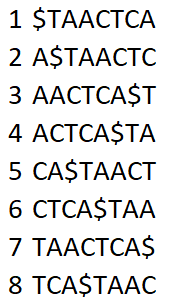

Then, we can create an FM-index, shown as following below:

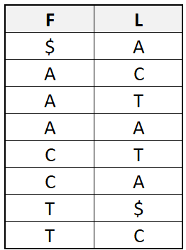

2. Show how many times the pattern 'CA' occurs in original string using the FM index and LF(i) (Last-to-First) function

**(A) :** First of all,we need to create table C[c] and a function Occ(c, k). C[c] is the table which contains the number of occurrences of lexically smaller characters in the text. The function Occ(c, k) is the number of occurrences of character c in the prefix L[1..k].

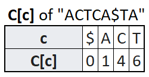
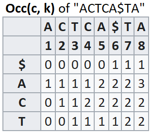

Then, we can implement LF(i) as following below :

LF(i) = C[L[i]] + Occ(L[i], i)

Then we can get the position `[5..6]`, where the location `CA` occured once `(6-5)`.

3. Does the pattern 'CATTA' appear in original string?

**(A) :** According to the algorithm in 1.2, there is no pattern `CATTA` in string.

# Task 2: Using the High Performance Computing Center (1 point)

1. If you have never used the HPC before, go through the introductory slides to learn what it's all about.

2. Log into the head node of the rocket cluster using ssh. If you are using Mac or Linux, you can do it straight from the command line: ssh <your_user_name>@rocket.hpc.ut.ee. On Windows you might need to install Putty. More instructions are available here.

**(A) :**
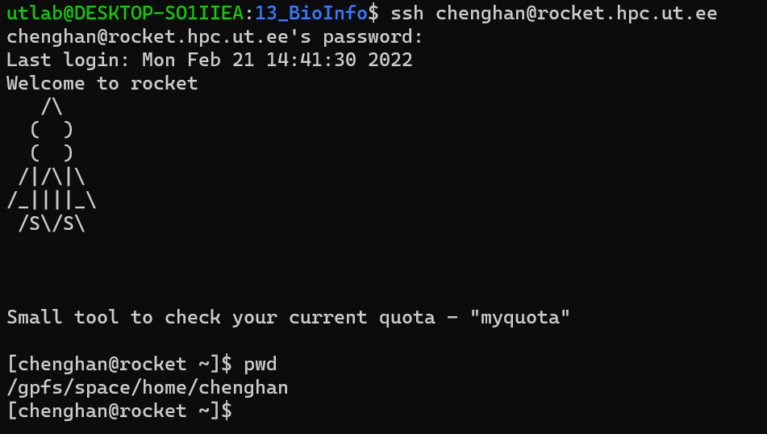

3. Submit your first jobs to the cluster by following the SLURM submit job tutorial and look at it's output.

**(A) :**
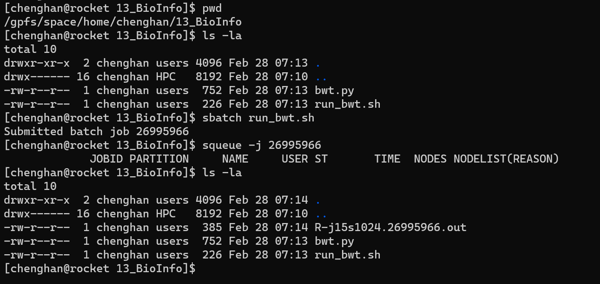

4. Learn how to transfer files between your computer and the HPC system. On Mac I prefer to use the Cyberduck sftp client and it might work on Windows as well. Another option is FileZilla, which should also work on all three platforms. If you prefer command line over Graphical User Interfaces please check out the scp usage.

**(A) :**
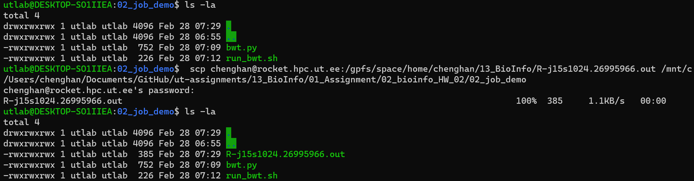

5. Demonstrate the you have managed to successfully execute your first job by copying the contents of the SLURM output file into your report.

**(A) :** About job and result, please refer to folder `02_job_demo`.

# Task 3: RNA-seq alignment (2 points)

Using the RNA-seq alignment tutorial, answer the following questions:


1. How many reads are there in the `fikt_A.1.fastq.gz` and `fikt_A.2.fastq.gz` FASTQ files?

**(A) :** By using combination of `zcat` and `wc`, we can count the number of line in those two files, the reult shown as following below:

    **fikt_A.1.fastq.gz :** 2364728

    **fikt_A.2.fastq.gz :** 2364728

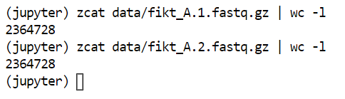


2. Following the instructions, align the FASTQ files to the reference genome. Sort the alignments by position and create the index.

**(A) :**

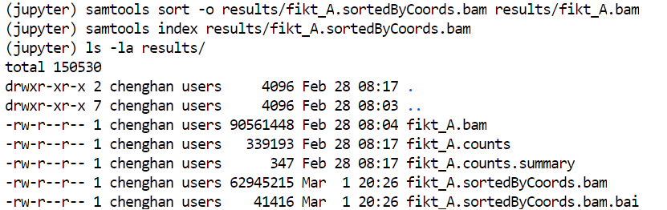

3. What fraction of the reads mapped to the reference genome? (HINT: use samtools flagstat).

**(A) :** 150530

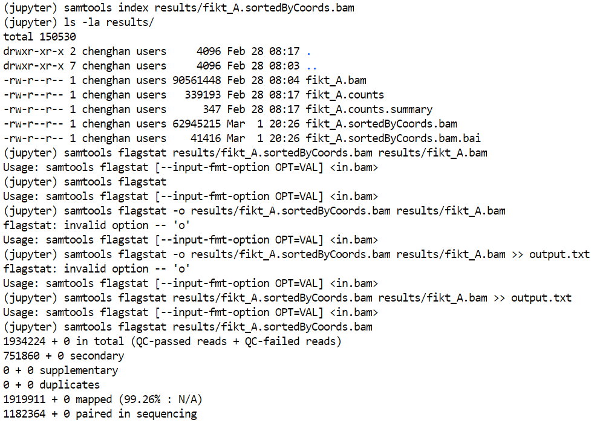

4. What fraction of the paired-end fragments were assigned to genes? (HINT: You can find this from the summary file created by featureCounts)

**(A) :**

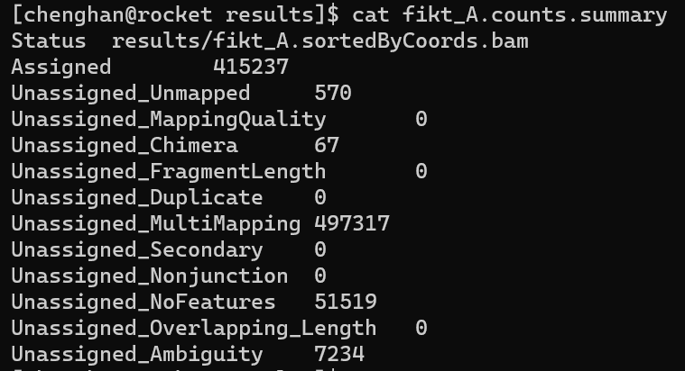

5. Copy to sorted BAM file together with the index from the HPC to your own environment (See Task 2). Open the BAM file in IGV. Zoom into the PFKL gene on chromosome 21. You should be able to see individual reads mapping to the exons of the gene. Now move to the neighbouring AIRE gene. What do you see? Make IGV screenshots for both genes and include them into your report.

**PFLK**


**AIRE**

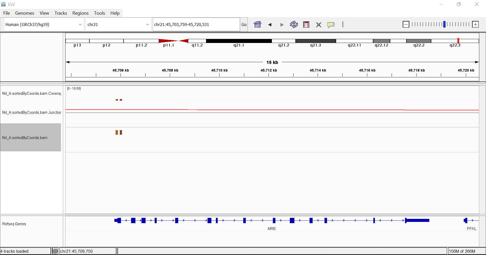

6. Find the number of paired-end fragments overlapping the PFKL and AIRE genes from the featureCounts file (last column). Do these broadly match what you observed in the IGV? (No need to count fragments manually from IGV) (HINT: You can use the search box on the Ensembl website to find the gene ids for both gens).

7. Repeat the same processing steps on all of the four samples (fikt_A, fikt_C, eipl_A, eipl_C) found in Zenodo. Report the paired-end fragment counts for PFKL and AIRE genes in all four samples.