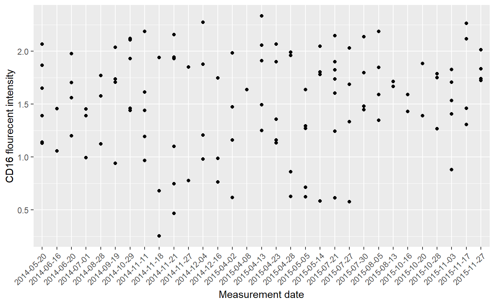
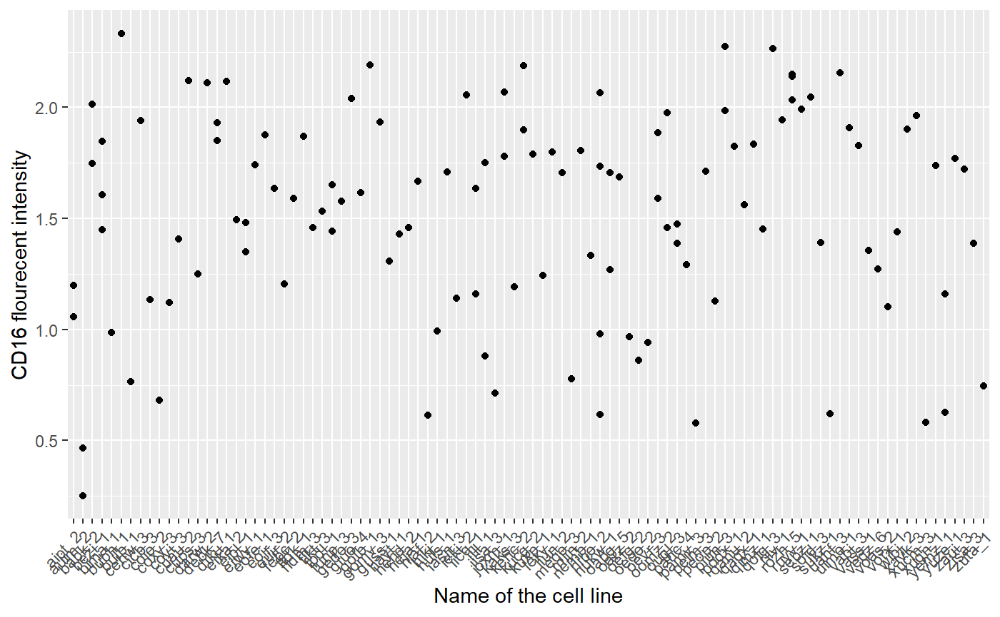
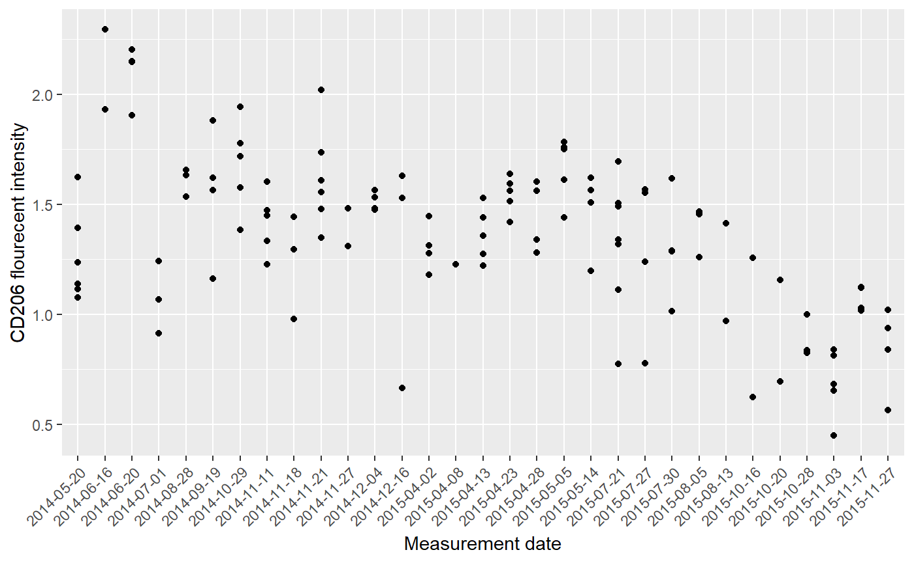
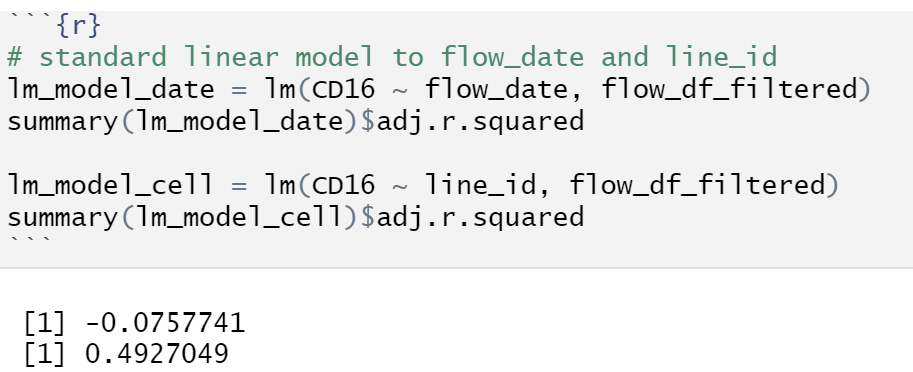
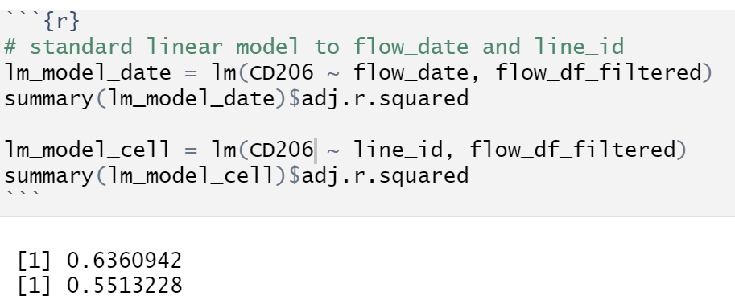

# Task 1: Variance component analysis (2 point)

1. Does the cell line (line_id) explain most of variance observed in the expression of these proteins as well (like CD14) or is the contribution of flow_date larger for them?

    **(A) :** The cell line is still hard to explain most of variance in the expression because of lack of data point of measurements in CD16 and CD206 (Some of the cell line only has 1 measurement which can not tell you much information). However, if we see the dataset by date, we can see most of date has more data point of measurements, it can tell us variance between dates.

2. Please illustrate your conclusions by making the same dot plots that were used under the section "Visualising sources of variation" to prove your point.

    **(A) :** The dot plot of **CD16** by cell line and date shown as below:
    
    

    

    The dot plot of **CD206** by cell line and date shown as below:

    

    

3. Do you get the same result when you fit line_id and flow_date as fixed effects in standard linear model (lm)? (Hint: Fit two separate linear models, one with line_id as a fixed effect and another one with flow_data as fixed effect, make sure that you convert flow_date to factor first (as.factor).

    **(A) :** No, I did not get the same result of line_id and flow_date in CD16 and CD206. the result shown as following below:

    

    